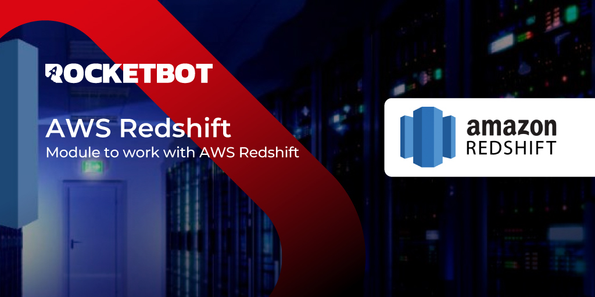

# AWSRedshift
  
Módulo para trabajar con base de datos Redshift.  

*Read this in other languages: [English](Manual_AWSRedshift.md), [Português](Manual_AWSRedshift.pr.md), [Español](Manual_AWSRedshift.es.md)*
  

## Como instalar este módulo
  
Para instalar el módulo en Rocketbot Studio, se puede hacer de dos formas:
1. Manual: __Descargar__ el archivo .zip y descomprimirlo en la carpeta modules. El nombre de la carpeta debe ser el mismo al del módulo y dentro debe tener los siguientes archivos y carpetas: \__init__.py, package.json, docs, example y libs. Si tiene abierta la aplicación, refresca el navegador para poder utilizar el nuevo modulo.
2. Automática: Al ingresar a Rocketbot Studio sobre el margen derecho encontrara la sección de **Addons**, seleccionar **Install Mods**, buscar el modulo deseado y presionar install.  

## Descripción de los comandos

### Conectar
  
Configura conexión redshift, puedes usar un identificador para cambiar entre otras conexiones
|Parámetros|Descripción|ejemplo|
| --- | --- | --- |
|Url de Servidor|Url de servidor, puede ser una IP o un dominio|example cluster.abc123xyz789.us-west-1.redshift.amazonaws.com|
|Puerto|Puerto de conexión, por defecto 5439|5439|
|Base de datos|Nombre de la base de datos|database_name|
|Usuario|Usuario de la base de datos|Rocketbot|
|Contraseña|Contraseña del usuario|secr3t_p@ss|
|Resultado|Variable donde se almacena el resultado de la conexión|conectado|

### Consulta Redshift
  
Realiza una consulta Redshift(Select, insert, delete, etc)
|Parámetros|Descripción|ejemplo|
| --- | --- | --- |
|Consulta|Consulta a realizar|select * from db|
|Resultado|Variable donde se almacena el resultado de la consulta|resultado|

### Cerrar conexión
  
Cierra una conexión de Redshift por sesión
|Parámetros|Descripción|ejemplo|
| --- | --- | --- |
