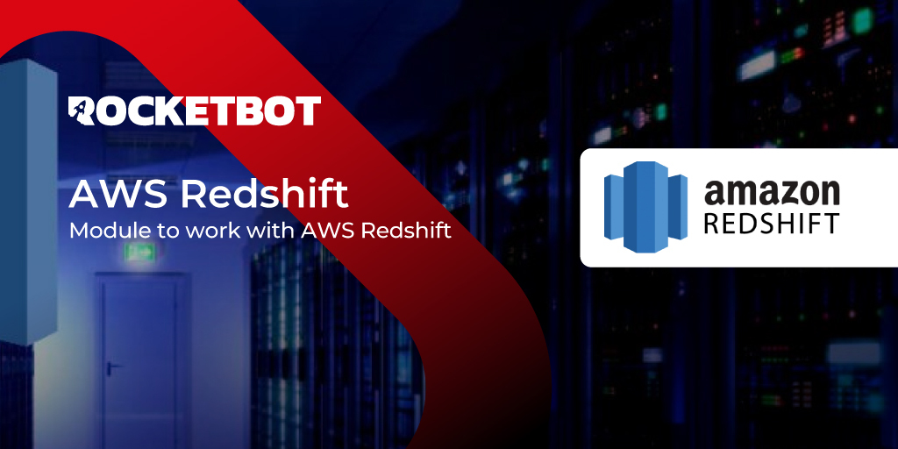

# AWSRedshift
  
Module to work with Redshift database.  

*Read this in other languages: [English](Manual_AWSRedshift.md), [Português](Manual_AWSRedshift.pr.md), [Español](Manual_AWSRedshift.es.md)*
  

## How to install this module
  
To install the module in Rocketbot Studio, it can be done in two ways:
1. Manual: __Download__ the .zip file and unzip it in the modules folder. The folder name must be the same as the module and inside it must have the following files and folders: \__init__.py, package.json, docs, example and libs. If you have the application open, refresh your browser to be able to use the new module.
2. Automatic: When entering Rocketbot Studio on the right margin you will find the **Addons** section, select **Install Mods**, search for the desired module and press install.  

## Description of the commands

### Connect
  
Configure redshift connection to server
|Parameters|Description|example|
| --- | --- | --- |
|Url Server|Server url, can be an IP or a domain|example cluster.abc123xyz789.us-west-1.redshift.amazonaws.com|
|Port|Connection port, default 5439|5439|
|Database|Database name|database_name|
|User|Database user|Rocketbot|
|Password|User password|secr3t_p@ss|
|Result|Variable where the result of the connection is stored|connected|

### Query Redshift
  
Create Redshift query (Select, insert, delete, etc)
|Parameters|Description|example|
| --- | --- | --- |
|Query|Query to execute|select * from db|
|Result|Variable where the result of the query is stored|result|

### Close connection
  
Close Redshift connection for session
|Parameters|Description|example|
| --- | --- | --- |
